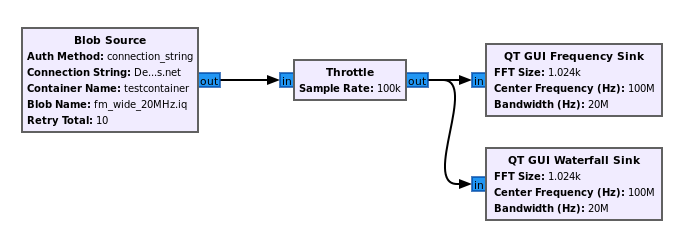
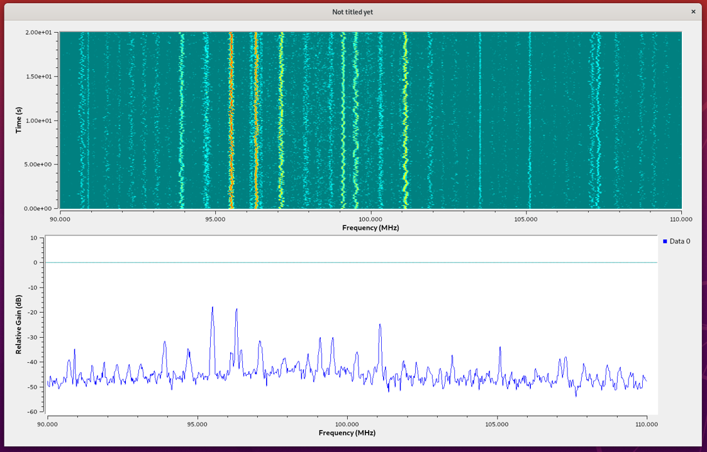

## Stage 1 (GNU Radio Setup and Viewing a Signal)

<starting from a fresh Ubuntu 20.04 Server VM (not our dev VM) with RDP already set up>

First we will install GNU Radio using the public PPA:
```console
sudo add-apt-repository ppa:gnuradio/gnuradio-releases
sudo apt-get update
sudo apt install -y gnuradio
```

Next, open up GNU Radio Companion (GRC) in a new terminal:
```console
gnuradio-companion
```


Note the blocks available on the right panel, they are all under the Core category, which means they come with GNU Radio. Soon we'll add the Azure blocks and you'll see a new category.


The main window is called the canvas, and it's where we will build our flowgraph.  A flowgraph is a connection of blocks through which a continuous stream of samples flows. The concept of a flowgraph is an acyclic directional graph with one or more source blocks (to insert samples into the flowgraph), and one or more sink blocks (to visualize or export samples from the flowgraph), and any signal processing blocks in between.

To create our first flowgraph, start by clicking the magnitfying glass towards the top-right, and in the search box begin to type "Signal Source"; when you see it come up (it's under the Waveform Generators) category, 
either double click it or drag it to the left, in order to add it to the canvas.  Repeat this process to add a Throttle block and QT GUI Time Sink block.


The Signal Source block will generate a simulated signal for us to visualize with the QT GUI Time Sink block, which will show us the time domain of that signal.  Because there is no hardware (e.g. SDRs) involved in this flowgraph, we need to add a Throttle block to prevent the Signal Source from generating samples as fast as the CPU allows.  

Now we must connect the blocks.  The blue ports represent the blocks inputs and outputs.  You can click on the output of one, then click on the input of another, to connect them.
The blocks should change from red to blank indicating there are no errors.  


However, there is still an error in the Options block, because we haven't set the ID of our flowgraph.

Double click the Options block, and change the ID parameter to whatever you want (e.g., my_first_flowgraph).  Next save the flowgraph, e.g. my_first_flowgraph.grc.
Now hit the play button.  You will see a warning message pop up, this only happens once and can be ignored, just hit OK. 


You should see two sine waves, Try zooming in by dragging a rectangle inside the plot window.  When you are done visualizing the signal, close the plot window.


You may have noticed there were two sine waves, that's because we were simulating a complex sinusoid which has a real and imagininary part.  For now let's simplify things 
and simulate a real sine wave.  Open each of the three blocks (double click) and change Type from complex to float.  You'll notice the input/output ports go from blue to orange.
Now run the flowgraph and you'll see just a single sine wave.  Close the plot, and try changing the Signal Source's frequency from 1000 to 100, and run the flowgraph to see how it changes.


If you would like a more detailed tutorial about creating and operating flowgraphs, please see [this GNU Radio tutorial](https://wiki.gnuradio.org/index.php/Guided_Tutorial_GRC).

Next let's install the gr-azure-software-radio out-of-tree module (OOT) so we can work with Azure.  Close GNU Radio altogether, and in your terminal do the following commands:

Install the Azure CLI with:
curl -sL https://aka.ms/InstallAzureCLIDeb | sudo bash

Next lets clone our azure-software-radio repo and install all dependencies with:
```console
sudo apt-get install -y cmake python3-pip liborc-dev doxygen
cd ~
git clone https://github.com/microsoft/azure-software-radio.git
cd azure-software-radio/
cd gr-azure-software-radio/
pip install pytest pybind11
pip install -r python/requirements.txt
```

Now to build and install the OOT:
```console
mkdir build
cd build
cmake ..
make -j4
sudo make install
sudo ldconfig
```

THIS IS WHEN I RAN INTO THE ERROR "The path was deleted, renamed, or moved to another location." AND SWITCHED TO USING OUR DEV VM

Create an azure-software-radio VM using the instructions [here](https://github.com/microsoft/azure-software-radio/blob/documentation/cli-updates/pages/devvm.md]).

Once you open the VM and remote desktop into it, before starting GR, go into an azure portal or use the CLI to add a storage account and container.  

NOTE TO REMOVE 
marcazsrsdktestsa
marclichtman-test-1-rg
testcontainer

Make note of the storage account's URL, which is based on your storage account name, using the format:  http://yoursa.blob.core.windows.net replacing yoursa with your storage account name.

Open a terminal in the VM and do
```console
az login
```

Login into your azure account.

In the same terminal, open GR with:
```console
gnuradio-companion
```

<where do i store this .grc example and blob where others can access it?>

<Clone/open grc file FILL THIS OUT WHEN WE KNOW WHERE ITS STORED>

This example flowgraph consists of four blocks.  The samples are originating from the Blob Source, which is feeding a signal recording stored in blob storage. 




<I was only able to get blob to work with connection string, not the default method of using az login, it just stalled out on me>

Hit the play button to run this new flowgraph, and you should see the following GUI pop up, visualizing the wideband FM radio signal stored in blob storage:



Let's say you are interested in finding the precise center frequency of one of the FM radio signals.  You can zoom into one of them by selecting a rectangle with your cursor:


And then hover over the center of the signal with your cursor to see the frequency (and power level) at the exact position of your cursor.


Notes for Craig about my first time on the VM

- should give it a fun GNU Radio background or something =)
- desktop icons?
- would have been nice if there was a cout/print after the blob finished storing so i know it worked
- the blob source should have a repeat option, like file source *very important*