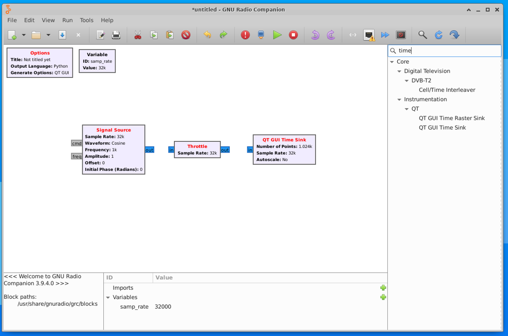
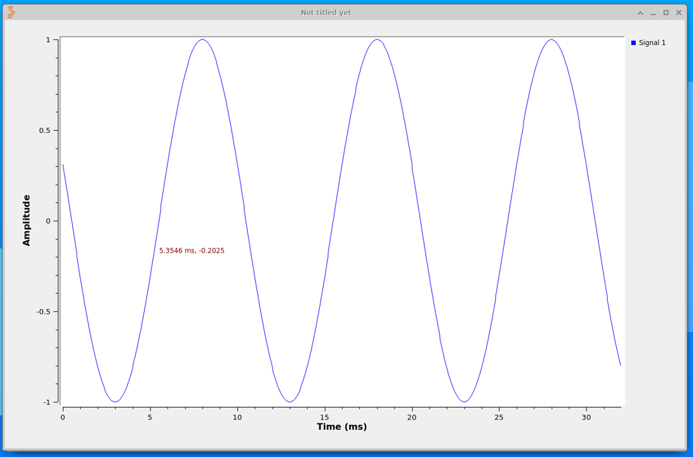
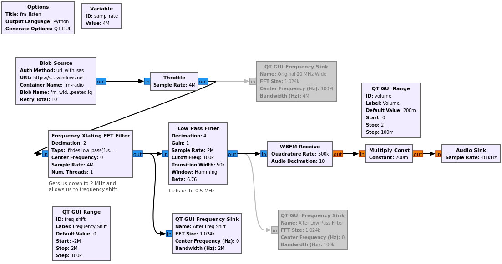
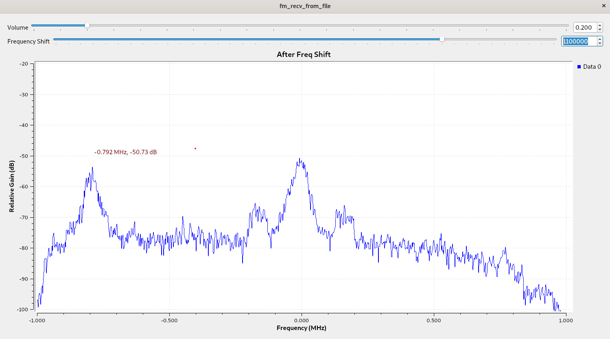

## Stage 1 (GNU Radio Setup and Viewing a Signal)

GNU Radio is a free & open-source software development toolkit that provides signal processing blocks to implement software-defined radios (SDRs). It can be used with readily-available RF hardware, or without hardware in a simulation-like environment. It is widely used in research, industry, academia, government, and hobbyist environments to support both wireless communications research and real-world radio systems.  Using a framework like GNU Radio to create applications allows for more easily sharing your application with others.

<center></center>

Throughout the stages of this tutorial we will show examples of performing SDR in the cloud, using Azure.

To get started, we offer two different methods of setting up the Ubuntu environment: [starting from a fresh Ubuntu 20 VM](#Starting-from-a-Fresh-Ubuntu-20-VM) or [using our GNU Radio development VM in Azure Marketplace](Creating-GNU-Radio-Development-VM-in-Azure).

### Starting from a Fresh Ubuntu 20 VM

Create an Ubuntu 20.04 LTS Server VM, SSH in, and set up remote desktop either [using these steps](http://go.microsoft.com/fwlink/?LinkId=2116615) or the commands below:

```console
sudo apt-get update
sudo apt-get -y install xfce4
sudo apt install xfce4-session
sudo apt-get -y install xrdp
sudo systemctl enable xrdp
echo xfce4-session >~/.xsession
sudo service xrdp restart
```

Once you have a remote desktop connection into the VM, we can install GNU Radio.  In this section we will be installing GNU Radio from source, as it guarantees the best compatibility with 3rd party GNU Radio modules that we will want to use, and lets us use one of the latest versions.

We will first install the prerequisites:

```console
sudo apt install -y git cmake g++ libboost-all-dev libgmp-dev swig python3-numpy python3-mako python3-sphinx python3-lxml doxygen libfftw3-dev libsdl1.2-dev libgsl-dev libqwt-qt5-dev libqt5opengl5-dev python3-pyqt5 liblog4cpp5-dev libzmq3-dev python3-yaml python3-click python3-click-plugins python3-zmq python3-scipy python3-gi python3-gi-cairo gir1.2-gtk-3.0 libcodec2-dev libgsm1-dev pybind11-dev python3-matplotlib libsndfile1-dev python3-pip libsoapysdr-dev soapysdr-tools
sudo pip install pygccxml pyqtgraph
```

Next we must install Volk from source:

```console
cd ~
git clone --recursive https://github.com/gnuradio/volk.git
cd volk
mkdir build
cd build
cmake -DCMAKE_BUILD_TYPE=Release -DPYTHON_EXECUTABLE=/usr/bin/python3 ../
make -j4
sudo make install
sudo ldconfig
```
Now we can install GNU Radio, specifically version 3.9.  Note the first command below is a band aid fix for a bug related to cmake finding boost and looking in the wrong spot.  

```console
sudo ln -s /usr/include /include
cd ~
git clone https://github.com/gnuradio/gnuradio.git
cd gnuradio
git checkout maint-3.9
mkdir build
cd build
cmake -DCMAKE_BUILD_TYPE=Release -DPYTHON_EXECUTABLE=/usr/bin/python3 ../
make -j4
sudo make install
sudo ldconfig
```

If no errors occurred, you should now have GNU Radio installed!

### Installing Azure SDR Blocks from Source

Next let's install the gr-azure-software-radio out-of-tree module (OOT) so we can work with Azure.  A dependency is the Azure CLI which can be installed with:
```console
curl -sL https://aka.ms/InstallAzureCLIDeb | sudo bash
```

Next lets clone our azure-software-radio repo and install all dependencies with:
```console
sudo apt-get install -y cmake python3-pip liborc-dev doxygen
cd ~
git clone https://github.com/microsoft/azure-software-radio.git
cd azure-software-radio/
cd gr-azure-software-radio/
pip install pytest pybind11
pip install -r python/requirements.txt
```

Now to build and install the OOT:
```console
mkdir build
cd build
cmake ..
make -j4
sudo make install
sudo ldconfig
```

At this point you have GNU Radio and the Azure SDR blocks installed, you can skip to the section [Running GNU Radio](#Running-GNU-Radio).  The next portion of this tutorial (below) will show you how to spin up our custom GNU Radio development VM which is currently on the Azure Marketplace in Private Preview.  It is essentially replicating what you just did, but with far fewer steps.

### Creating GNU Radio Development VM in Azure

By using our preconfigured development VM, not only are you skipping the steps shown in the previous section of this tutorial, but you are also getting a VM that already has audio passthrough configured (e.g., for listening to a demodulated audio signal), as well as GPU support for applications like gr-fosphor.

Create an azure-software-radio VM using the instructions [here](https://github.com/microsoft/azure-software-radio/blob/documentation/cli-updates/pages/devvm.md).

---I'm assuming that at some point we'll just merge Hello World with these instructions?

Only addition needed to linked docs: in Step 3 when you go to create the Virtual Machine, under Size, note how it suggests using Standard_NV12s_v3.  This is because the NV series VMs have a GPU and are specifically designed for desktop accelerated applications and virtual desktops.  If you are using a trial Azure subscription and don't have access to NV series VMs, that's OK, we do not require a GPU for any of the steps in this tutorial.

### Running GNU Radio

To actually use GNU Radio, you must open up GNU Radio Companion (GRC) in a new terminal.  GRC is the graphical interface or front-end for GNU Radio.  You can either search for the app in Ubuntu app drawer, or open a terminal and type:
```console
gnuradio-companion
```

<center></center>

A window should pop up running GRC.  Note the blocks available on the right panel, they are all under the Core category, which means they come with GNU Radio. Soon we'll add the Azure blocks and you'll see a new category.

<center></center>

The main window is called the canvas, and it's where we will build our flowgraph.  A flowgraph is a connection of blocks through which a continuous stream of samples flows. The concept of a flowgraph is an acyclic directional graph with one or more source blocks (to insert samples into the flowgraph), and one or more sink blocks (to visualize or export samples from the flowgraph), and any signal processing blocks in between.

To create our first flowgraph, start by clicking the magnifying glass towards the top-right, and in the search box begin to type "Signal Source"; when you see it come up (it's under the Waveform Generators) category, 
either double click it or drag it to the left, in order to add it to the canvas.  Repeat this process to add a Throttle block and QT GUI Time Sink block.

<center></center>

The Signal Source block will generate a simulated signal for us to visualize with the QT GUI Time Sink block, which will show us the time domain of that signal.  Because there is no hardware (e.g. SDRs) involved in this flowgraph, we need to add a Throttle block to prevent the Signal Source from generating samples as fast as the CPU allows.  

Now we must connect the blocks.  The blue ports represent the blocks inputs and outputs.  You can click on the output of one, then click on the input of another, to connect them.
The blocks should change from red to blank indicating there are no errors.  

<center></center>

However, there is still an error in the Options block, because we haven't set the ID of our flowgraph.

Double click the Options block, and change the ID parameter to whatever you want (e.g., my_first_flowgraph).  Next save the flowgraph wherever you want, e.g. my_first_flowgraph.grc.
Now hit the play button.  You will see a warning message pop up, this only happens once and can be ignored, just hit OK. 

<center></center>

You should see two sine waves, Try zooming in by dragging a rectangle inside the plot window.  When you are done visualizing the signal, close the plot window.

<center></center>

You may have noticed there were two sine waves, that's because we were simulating a complex sinusoid which has a real and imaginary part.  For now let's simplify things 
and simulate a real sine wave (if you want to learn more about complex signals, we recommend [this tutorial](https://wiki.gnuradio.org/index.php?title=IQ_Complex_Tutorial)).  Open each of the three blocks (double click) and change Type from complex to float.  You'll notice the input/output ports go from blue to orange.
Now run the flowgraph and you'll see just a single sine wave.  Close the plot, and try changing the Signal Source's frequency from 1000 to 100, and run the flowgraph to see how it changes.

<center></center>

As a reference, the completed flowgraph can be found in flowgraphs/my_first_flowgraph.grc within this repo.  

If you would like a more detailed tutorial about creating and operating flowgraphs, please see [this GNU Radio tutorial](https://wiki.gnuradio.org/index.php/Guided_Tutorial_GRC).


### Using GNU Radio with Azure

Close GRC if it is open.  Open a terminal in the VM and type:
```console
az login
```

Login into your azure account.

In the same terminal, open GR with:
```console
gnuradio-companion
```

Within GRC, open the flowgraph [visualize_fm.grc](./flowgraphs/visualize_fm.grc)  in the flowgraphs directory of this repo. 

This example flowgraph consists of four blocks.  The samples are originating from the Blob Source, which is feeding a signal recording stored in blob storage.  The Blob Source has been preconfigured to connect to an Azure storage account we created to host several RF recordings, with an access level set to public read access.

<center></center>

Hit the play button to run this new flowgraph, and you should see the following GUI pop up, visualizing the wideband FM radio signal stored in blob storage:

<center></center>

The top half is a spectrogram, a.k.a. waterfall plot, which displays frequency (x-axis) over time (y-axis).  This signal recording was created by tuning an SDR to 100 MHz, roughly the center of the FM radio band, and receiving 20 MHz of spectrum.  The bottom half shows the power spectral density, i.e. frequency domain, with a y-axis of magnitude.  Each squiggly yellow/red vertical line you see is an FM radio station; some are being received at a higher power than others.  A real FM radio receiver would not receive the entire band, it would tune directly to one of these signals and receive with a bandwidth just wide enough to capture the signal.  The audio within each signal is not being demodulated as part of this flowgraph; that would require several additional blocks.

Let's say you are interested in finding the precise center frequency of one of the FM radio signals.  You can zoom into one of them by selecting a rectangle with your cursor:

<center></center>

And then hover over the center of the signal with your cursor to see the frequency (and power level) at the exact position of your cursor.

<center></center>

If you are using our GNU Radio development VM, and are on an NV-series VM with a discrete GPU, you can try replacing the two QT GUI blocks (delete or disable them) with a Fosphor Sink QT block.  You will have to set the Span (Hz) parameter to 20e6.  This Fosphor block is part of the gr-fosphor OOT, and it uses the GPU to compute the FFTs and has a fancier looking spectrum display.  If it worked, you should see the following output:

<center></center>

Configuring the GPU and CUDA to work with GNU Radio is not a trivial task, but luckily the development VM comes with it already completed. 

Now let's actually demodulate and listen to the FM radio signals, note that for pass-through audio to work you will either need to be using our GNU Radio development VM or have configured audio-passthrough yourself.  Please open the [listen_to_fm.grc flowgraph](flowgraphs/listen_to_fm.grc). 

<center></center>

For now ignore the greyed out boxes, and the QT GUI boxes.  What is left represents the signal processing needed to actually extract the audio signal from the FM signal, which we call demodulation.  Because we started with a 20 MHz wide RF recording that contained many FM signals, we first have to "zoom in" to the signal we want to demodulate, which is what the Frequency Translating Filter does, it performs a frequency shift and decimation.  Next we low pass filter to get rid of as much noise and adjacent signals as possible.  The output is then fed through the wideband FM receive block, which performs the actual demodulation, it converts the variations in frequency to variations in amplitude.  The output is our audio signal, we pass it through a Multiply Constant block which acts as our volume knob, and lastly feed it into the Audio Sink block which attempts to play it through the computer's sound.

When you run the flowgraph you will notice two adjustable bars: one for the volume knob and another to tune the radio.  It is set to perform the frequency shift in increments of 100 kHz, and if you recall, our original signal was centered at 100 MHz.  This will let us tune exactly to the frequencies of these FM radio stations, such as 101.1 MHz and 99.5 MHz.  Try hitting the up arrow, or sliding the bar, next to the one labeled Frequency Shift.  As you sweep across frequency you should hear FM radio stations coming in and out, there might be a slight delay due to the signal processing and audio passthrough.  You will notice that as the hump-shaped signals reach the center of the frequency plot (at 0 MHz), they become clear.  This is because the signals must be brought to baseband, i.e., centered at 0 Hz, to be properly demodulated.

NOTE THAT ON THE DEVELOPER VM I"M GETTING A LOT OF CHOPPYNESS, IT"S PLAYING AUDIO AT A DUTY CYCLE AROUND 50%, NOT A VERY GOOD EXPERIENCE!

<center></center>

Optionally, if you would like to be able to upload your own signal recordings and store them in the cloud, you will need to [create an Azure storage account](https://docs.microsoft.com/en-us/azure/storage/common/storage-account-create?tabs=azure-portal), and then [create a container](https://docs.microsoft.com/en-us/azure/storage/blobs/blob-containers-powershell) within that storage account.  The container's access level must be set to `Container (anonymous read access for containers and blobs)` to use the `url_with_sas` authentication option without having to actually add a SAS token to the URL.  Note the name of your storage account and the name of your container, because it will determine what goes in the Blob Source/Sink block parameters in GNU Radio.  The URL will use the format: https://yoursa.blob.core.windows.net replacing `yoursa` with your storage account name.  The container and blob name is entered as its own parameter in the block.

<center></center>

As a side note, if the access level is set as described, for convenience sake you can download the file via browser by going to the url plus the container and blob name appended on, for example:  https://softwareradiohelloworld.blob.core.windows.net/fm-radio/fm_wide_20MHz_short.iq

The point of this entire demonstration was to show how an RF recording stored in blob storage can be pulled down into a GNU Radio flowgraph, which can then visualize the recording in time and frequency.  For the next stage see **[Stage 2](../stage2/hello_world_stage2.md)** 
