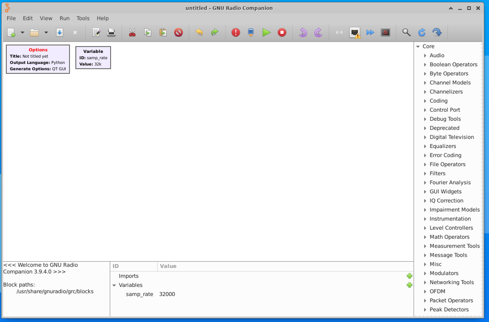
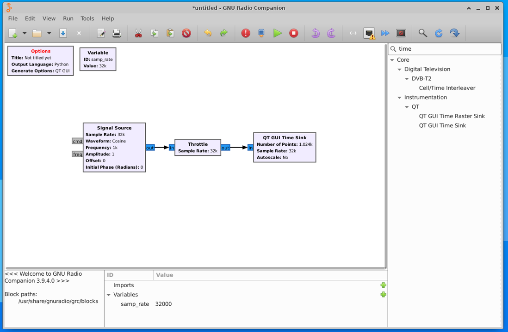
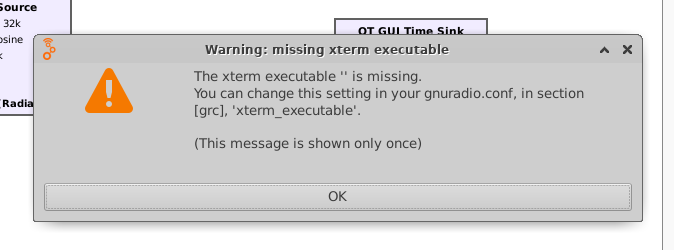
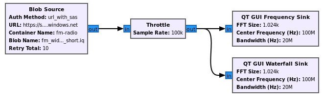

## Stage 1 (GNU Radio Setup and Viewing a Signal)

Create an Ubuntu 20.04 LTS Server VM, SSH in, and set up remote desktop either [using these steps](http://go.microsoft.com/fwlink/?LinkId=2116615) or the commands below:

```console
sudo apt-get update
sudo apt-get -y install xfce4
sudo apt install xfce4-session
sudo apt-get -y install xrdp
sudo systemctl enable xrdp
echo xfce4-session >~/.xsession
sudo service xrdp restart
```

### Installing GNU Radio from Source
Once you have a remote desktop connection into the VM, we can install GNU Radio.  In this section we will be installing GNU Radio from source, as it gaurantees the best compatbility with 3rd party GNU Radio modules that we will want to use, and lets us use one of the latest versions.

We will first install the prerequisites:

```console
sudo apt install -y git cmake g++ libboost-all-dev libgmp-dev swig python3-numpy python3-mako python3-sphinx python3-lxml doxygen libfftw3-dev libsdl1.2-dev libgsl-dev libqwt-qt5-dev libqt5opengl5-dev python3-pyqt5 liblog4cpp5-dev libzmq3-dev python3-yaml python3-click python3-click-plugins python3-zmq python3-scipy python3-gi python3-gi-cairo gir1.2-gtk-3.0 libcodec2-dev libgsm1-dev pybind11-dev python3-matplotlib libsndfile1-dev python3-pip libsoapysdr-dev soapysdr-tools
sudo pip install pygccxml pyqtgraph
```

Next we must install Volk from source:

```console
cd ~
git clone --recursive https://github.com/gnuradio/volk.git
cd volk
mkdir build
cd build
cmake -DCMAKE_BUILD_TYPE=Release -DPYTHON_EXECUTABLE=/usr/bin/python3 ../
make -j4
sudo make install
sudo ldconfig
```
Now we can install GNU Radio, specifically version 3.9.  Note the first command below is a bandaid fix for a bug related to cmake finding boost and looking in the wrong spot.  

```console
sudo ln -s /usr/include /include
cd ~
git clone https://github.com/gnuradio/gnuradio.git
cd gnuradio
git checkout maint-3.9
mkdir build
cd build
cmake -DCMAKE_BUILD_TYPE=Release -DPYTHON_EXECUTABLE=/usr/bin/python3 ../
make -j4
sudo make install
sudo ldconfig
```

If no errors occured, you should now have GNU Radio installed!

### Running GNU Radio

Next, open up GNU Radio Companion (GRC) in a new terminal:
```console
gnuradio-companion
```


Note the blocks available on the right panel, they are all under the Core category, which means they come with GNU Radio. Soon we'll add the Azure blocks and you'll see a new category.



The main window is called the canvas, and it's where we will build our flowgraph.  A flowgraph is a connection of blocks through which a continuous stream of samples flows. The concept of a flowgraph is an acyclic directional graph with one or more source blocks (to insert samples into the flowgraph), and one or more sink blocks (to visualize or export samples from the flowgraph), and any signal processing blocks in between.

To create our first flowgraph, start by clicking the magnitfying glass towards the top-right, and in the search box begin to type "Signal Source"; when you see it come up (it's under the Waveform Generators) category, 
either double click it or drag it to the left, in order to add it to the canvas.  Repeat this process to add a Throttle block and QT GUI Time Sink block.


The Signal Source block will generate a simulated signal for us to visualize with the QT GUI Time Sink block, which will show us the time domain of that signal.  Because there is no hardware (e.g. SDRs) involved in this flowgraph, we need to add a Throttle block to prevent the Signal Source from generating samples as fast as the CPU allows.  

Now we must connect the blocks.  The blue ports represent the blocks inputs and outputs.  You can click on the output of one, then click on the input of another, to connect them.
The blocks should change from red to blank indicating there are no errors.  



However, there is still an error in the Options block, because we haven't set the ID of our flowgraph.

Double click the Options block, and change the ID parameter to whatever you want (e.g., my_first_flowgraph).  Next save the flowgraph, e.g. my_first_flowgraph.grc.
Now hit the play button.  You will see a warning message pop up, this only happens once and can be ignored, just hit OK. 



You should see two sine waves, Try zooming in by dragging a rectangle inside the plot window.  When you are done visualizing the signal, close the plot window.


You may have noticed there were two sine waves, that's because we were simulating a complex sinusoid which has a real and imagininary part.  For now let's simplify things 
and simulate a real sine wave.  Open each of the three blocks (double click) and change Type from complex to float.  You'll notice the input/output ports go from blue to orange.
Now run the flowgraph and you'll see just a single sine wave.  Close the plot, and try changing the Signal Source's frequency from 1000 to 100, and run the flowgraph to see how it changes.


If you would like a more detailed tutorial about creating and operating flowgraphs, please see [this GNU Radio tutorial](https://wiki.gnuradio.org/index.php/Guided_Tutorial_GRC).

### Installing Azure SDR Blocks from Source

Next let's install the gr-azure-software-radio out-of-tree module (OOT) so we can work with Azure.  Close GNU Radio altogether, and in your terminal do the following commands:

Install the Azure CLI with:
curl -sL https://aka.ms/InstallAzureCLIDeb | sudo bash

Next lets clone our azure-software-radio repo and install all dependencies with:
```console
sudo apt-get install -y cmake python3-pip liborc-dev doxygen
cd ~
git clone https://github.com/microsoft/azure-software-radio.git
cd azure-software-radio/
cd gr-azure-software-radio/
pip install pytest pybind11
pip install -r python/requirements.txt
```

Now to build and install the OOT:
```console
mkdir build
cd build
cmake ..
make -j4
sudo make install
sudo ldconfig
```

At this point you have GNU Radio and the Azure SDR blocks installed, you can skip to the section [Using GNU Radio with Azure](#Using GNU Radio with Azure).  The next portion of this tutorial will show you how to spin up our custom GNU Radio development VM which is currently on the Azure Marketplace in Private Preview.

### Creating GNU Radio Development VM in Azure

Create an azure-software-radio VM using the instructions [here](https://github.com/microsoft/azure-software-radio/blob/documentation/cli-updates/pages/devvm.md]).

### Using GNU Radio with Azure

Open up a remote desktop connection to your VM. Before starting GRC, go into an Azure portal or use the CLI to add a storage account and container.  

Open a terminal in the VM and do
```console
az login
```

Login into your azure account.

In the same terminal, open GR with:
```console
gnuradio-companion
```
<Clone/open grc file FILL THIS OUT ONCE IT'S STORED IN GIT>

This example flowgraph consists of four blocks.  The samples are originating from the Blob Source, which is feeding a signal recording stored in blob storage. 



Hit the play button to run this new flowgraph, and you should see the following GUI pop up, visualizing the wideband FM radio signal stored in blob storage:


Let's say you are interested in finding the precise center frequency of one of the FM radio signals.  You can zoom into one of them by selecting a rectangle with your cursor:


And then hover over the center of the signal with your cursor to see the frequency (and power level) at the exact position of your cursor.


If you would like to be able to upload your own signal recordings and store them in the cloud, you will need to create an Azure Storage Account, with at least one blob container.  The following lines can be entered into Azure CLI, either using Azure Portal in the browser or a local Azure CLI.

MENTION HOW THE PARTIAL AND FULL URL IS FORMED
https://marcpubliciqblobssa.blob.core.windows.net
public-iq-blobs
connection string:
DefaultEndpointsProtocol=https;AccountName=marcpubliciqblobssa;AccountKey=+MGGfNpP6Ht+6nY7gPbwO54ZOIAN19SNvqhlbsrgl900Hb1d3aELZUv3Y48BQSv01fht+WYMcYjwIJ5VSrHKkQ==;EndpointSuffix=core.windows.net

Make note of the storage account's URL, which is based on your storage account name, using the format:  https://yoursa.blob.core.windows.net replacing yoursa with your storage account name.