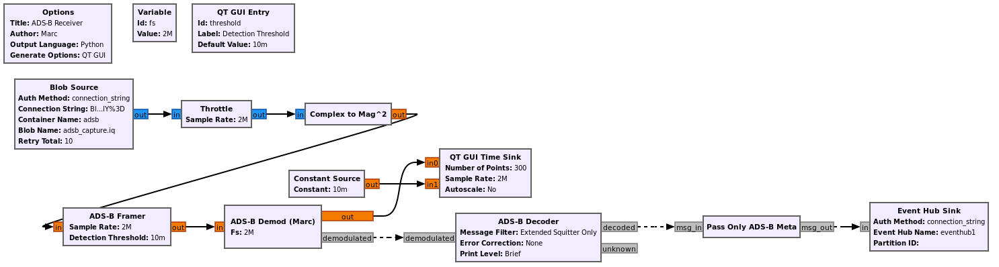
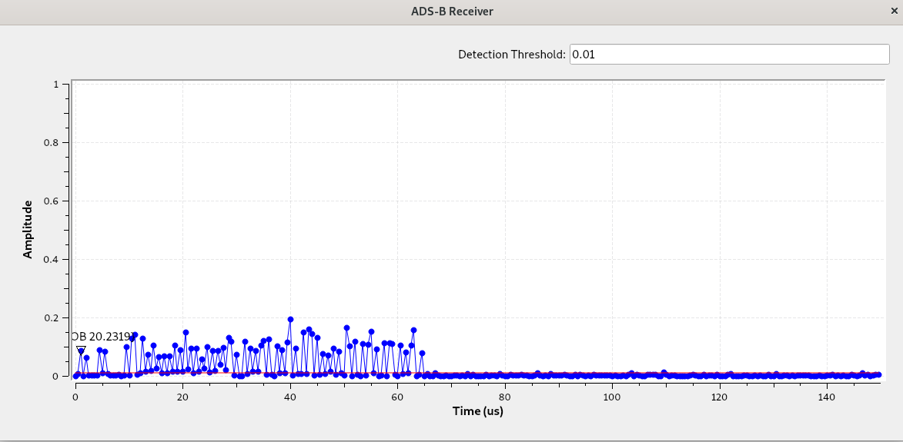

## Stage 2

Stage 2 is split into two parts, first we will show how ADS-B signals can be decoded and sent to Azure event hub.  Next, we incorporate PowerBI to plot the location of aircraft on a map-based interface within Azure. 

Automatic Dependent Surveillance–Broadcast (ADS–B) is a wireless technology used by aircraft to broadcast their position and other onboard sensor data. The information can be received by air traffic control ground stations, as well as other aircraft, to provide situational awareness. ADS–B is automatic, i.e., it requires no pilot input. The data sent over ADS-B originates from the aircraft's navigation system and other sensors.  In terms of the signal, it's transmitted at 1090 MHz, uses pulse position modulation (PPM), and the signal has a bandwidth around 50 kHz (it's a very low data rate signal).

 For those who skipped the manual installation of GNU Radio steps, this will be the first time installing a GNU Radio out-of-tree module (OOT) from source.  OOTs are an important part of GNU Radio, as GNU Radio only comes with a basic set of building blocks, and most application-specific blocks are found in 3rd party OOTs.  In addition, if you build your own GNU Radio application, there is a good chance you will want to create your own OOT to contain the custom blocks created.  Most OOTs are installed using the same set of steps, although some have additional depedencies.

### Installing ADS-B

The process of installing ADS-B onto a system with GNU Radio already installed is as follows.  Open a terminal and type:
```console
git clone https://github.com/mhostetter/gr-adsb.git
cd gr-adsb
mkdir build
cd build
cmake ..
make
sudo make install
sudo ldconfig
```

This process is the same for most GNU Radio OOTs, you simply replace the github url with whichever OOT you are trying to install.  Note that some OOTs have dependencies beyond what GNU Radio depends on, and may have an extra `apt install` step.  You will know the installation of gr-adsb was successful because additional ADS-B blocks will be available in GNU Radio.

### ADS-B and Event Hub

Open GRC, and open the flowgraph adsb_rx_2.grc which is in the stage2/flowgraphs directory. 

<center></center>

The first block, which is where the samples originate from, is the same Blob Source we used in Stage 1, but this time we are pulling down an RF recording that contains a capture of ADS-B, taken in the DC area.  The signal is converted from complex samples to magnitude squared, due to the nature of PPM modulation.  The ADS-B Framer/Demod/Decoder blocks work together to actually demodulate and decode the signal, we will not be diving into the details of how they work in this tutorial, but you can refer to [this tutorial](https://wiki.analog.com/resources/eval/user-guides/picozed_sdr/tutorials/adsb) for more information. 

The grey input/output ports may be new to you, they represent messages instead of samples.  The connections use a dashed line to represent the fact they are asynchronous.  In other words, the output of the Demod block goes to a Time Sink for visualization purposes, but the actual demodulated data is sent out over a message.  It turns out the Demod block sends the raw bits along with the metadata, so the Pass Only ADS-B Meta block is used to get rid of the raw bits because we don't want them sent to Event Hub.  The metadata, stored within the message, arrives at the Event Hub Sink block and the block converts it from a GNU Radio message to a JSON format, and sends it to an Event Hub endpoint.

When you run the flowgraph you should see the following output:

<center></center>

This shows the signal over time, and the display is triggering in such a way that the beginning of each packet is aligned to the left side.  So we can see that this particular packet was roughly 65 microseconds in duration.  

Looking at the GRC console on the bottom-left, you will see the following debug text:

```
[?1049h(B[?7h(B  Time    ICAO  Callsign  Alt  Climb Speed Hdng   Latitude    Longitude  Msgs(B ft  ft/m    kt   deg         deg         deg     (B
16:22:19 a46ab3222251
16:22:19 aa7e74-960   506    56120
20
[?1049l
```

This is actually the data from the aircraft, the first few lines are simply a header that is created when you started the flowgraph, but then every line after that represents a message from an aircraft.  This console output is not formatted correctly to view the data easily, but that is where Event Hub comes in.  

### PowerBI and Maps Interface

---Write once Luke has it working
