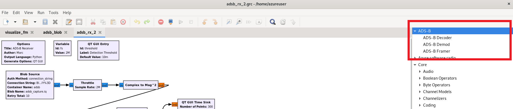
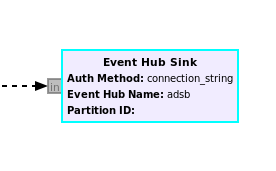
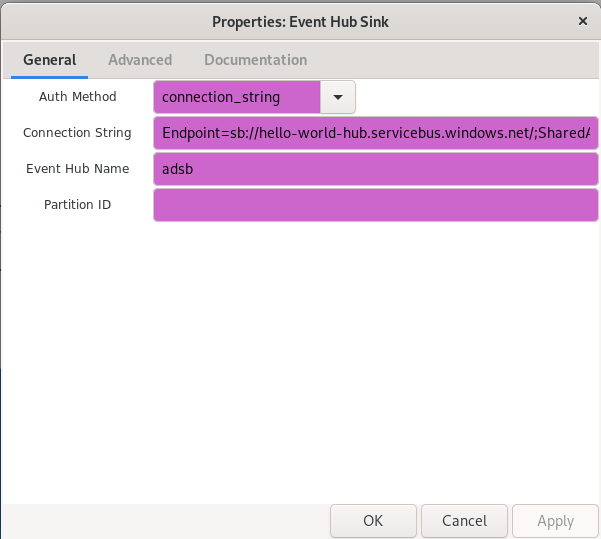
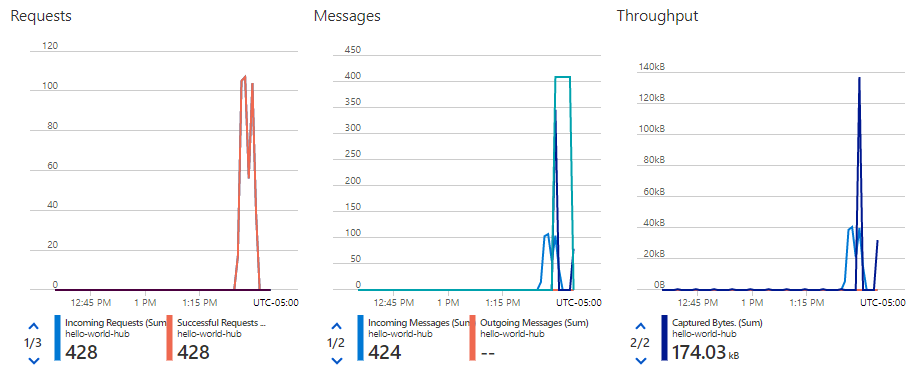
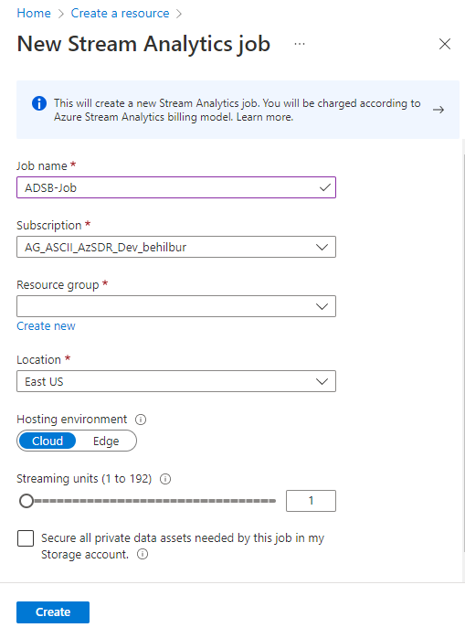

## Stage 2

Stage 2 is split into two parts, first we will show how ADS-B signals can be decoded and sent to Azure event hub.  Next, we incorporate PowerBI to plot the location of aircraft on a map-based interface within Azure. 

Automatic Dependent Surveillance–Broadcast (ADS–B) is a wireless technology used by aircraft to broadcast their position and other onboard sensor data. The information can be received by air traffic control ground stations, as well as other aircraft, to provide situational awareness. ADS–B is automatic, i.e., it requires no pilot input. The data sent over ADS-B originates from the aircraft's navigation system and other sensors.  In terms of the signal, it's transmitted at 1090 MHz, uses pulse position modulation (PPM), and the signal has a bandwidth around 50 kHz (it's a very low data rate signal).

<center></center>

For those who skipped the manual installation of GNU Radio steps, this will be the first time installing a GNU Radio out-of-tree module (OOT) from source.  OOTs are an important part of GNU Radio, as GNU Radio only comes with a basic set of signal processing blocks, and most application-specific blocks are found in 3rd party OOTs.  In addition, if you build your own GNU Radio application, there is a good chance you will want to create your own OOT to contain the custom blocks created.  Most OOTs are installed using the same set of steps, although some have additional depedencies.

### Installing ADS-B

The process of installing ADS-B onto a system with GNU Radio already installed is as follows.  Open a terminal and type:
```console
git clone https://github.com/mhostetter/gr-adsb.git
cd gr-adsb
mkdir build
cd build
cmake ..
make
sudo make install
sudo ldconfig
```

This process is the same for most GNU Radio OOTs, you simply replace the github url with whichever OOT you are trying to install.  Note that some OOTs have dependencies beyond what GNU Radio depends on, and may have an extra `apt install` step.  You will know the installation of gr-adsb was successful because additional ADS-B blocks will be available in GNU Radio as shown in the red box highlighted below:

<center></center>

### ADS-B and Event Hub

Open GRC, but this time, launch it by opening Ubuntu's Terminal application and typing in: `gnuradio-companion`. The **gr-adsb** module will print out additional information in this Terminal window while it is running. Now, open the flowgraph [adsb_event_hub.grc](flowgraphs/adsb_event_hub.grc) which is in the flowgraphs directory within this repo. 

<center></center>

The first block, which is where the samples originate from, is the same Blob Source we used in Stage 1, but this time we are pulling down an RF recording that contains a capture of ADS-B, taken in the DC area.  The signal is converted from complex samples to magnitude squared, due to the nature of PPM modulation.  The ADS-B Framer/Demod/Decoder blocks work together to actually demodulate and decode the signal, we will not be diving into the details of how they work in this tutorial, but you can refer to [this tutorial](https://wiki.analog.com/resources/eval/user-guides/picozed_sdr/tutorials/adsb) for more information. 

The grey input/output ports may be new to you, they represent messages instead of samples.  The connections use a dashed line to represent the fact they are asynchronous.  In other words, the output of the Demod block goes to a Time Sink for visualization purposes, but the actual demodulated data is sent out over a message.  It turns out the Demod block sends the raw bits along with the metadata, so the Pass Only ADS-B Meta block is used to get rid of the raw bits because we don't want them sent to Event Hub.  The metadata, stored within the message, arrives at the Event Hub Sink block and the block converts it from a GNU Radio message to a JSON format, and sends it to an Event Hub endpoint.

When you run the flowgraph you should see the following output:

<center></center>

This shows the signal over time, and the display is triggering in such a way that the beginning of each packet is aligned to the left side.  So we can see that this particular packet was roughly 65 microseconds in duration.  

If you switch windows and bring up the Terminal window you used to launch GRC, you should see the following:

```
  Time    ICAO  Callsign  Alt  Climb Speed Hdng   Latitude    Longitude  Msgs
                            ft  ft/m    kt   deg         deg         deg     
76:06:02 a46ab3 FFT2380  20775 -1728   425    15  38.7591705 -76.4883688   24
86:06:02 aa7e74          30000 -1024   507    56  38.6728060 -76.6093750   17
16:06:02 ab6394           5875  -128   237   179  38.9737663 -76.9388428    8
16:06:02 a609d4          36025   -64   514    25  38.4288025 -76.7635644    4
16:06:02 a95a1c          19000     0   393  -108  38.5884247 -76.6375799    8
16:06:02 a9b088 AAL966    6175 -1920   252   123  38.7975660 -77.0895386    6
66:06:02 a9f4c6          35000    64   476    48  38.5527191 -76.9266875    5
```


This is actually the data from the aircraft, which provides the aircraft location and heading, along with some identifying information. While this is useful for navigation systems, humans need to have this visualied and that is where Event Hub and Power BI come in. 

### PowerBI and Maps Interface

<center></center>

[Azure Event Hub](https://azure.microsoft.com/en-us/services/event-hubs/) is a real-time data ingestion service. We will be using it to recieve the ADS-B data that our GNU Radio flowgraph is generating and pass it along for visualization. [PowerBI](https://powerbi.microsoft.com/en-us/) makes it easy to build visualizations of your data and there is a [version](https://powerbi.com/) you can use in your browser. To connect Event Hubs to Power BI, we will be using the [Azure Stream Analytics](https://azure.microsoft.com/en-us/services/stream-analytics/) service which makes it easy to build data pipelines.

#### Event Hubs

The first step is to create an Event Hub. There is documentation for doing using the [Azure Portal](https://docs.microsoft.com/en-us/azure/event-hubs/event-hubs-create) or the [Azure CLI](https://docs.microsoft.com/en-us/azure/event-hubs/event-hubs-quickstart-cli).

After you have completed this, your new Event Hub should be list in the Resource Group you are using. You now need to get the Connection String for it, so the flowgraph can send messages to the Event Hub. Follow [these steps](https://docs.microsoft.com/en-us/azure/event-hubs/event-hubs-get-connection-string) to get the Connection String and copy it to your clipboard. 

Now return to the GRC window and find the Event Hub Sink block in the flowgraph.
<center></center>
 Right click the block and then select **Enable**. After that, double click to bring up the properties for the block. Select **connection_string** for the Auth Method and paste in the Connection String in the appropriate field. Enter the name of the Event Hub instance you created (not the namespace) in the Event Hub Name field. Now run the flowgraph again. 
 
 <center></center>
 If you go to the Azure Portal and navigate to your Event Hub instance, you should start to see the graphs show that messages are being recieved from the flowgraph.
 <center></center>

 #### Stream Analytics

 Now that we have the ADS-B in Azure, it is time to make it more accesible. Azure Stream Analytics makes it easy to connect services and applications to the streaming data coming from Event Hub. 

 Follow these steps to create a Stream Analytics Job:
 1. Sign in to the Azure portal.
 2. Select **Create a resource** in the upper left-hand corner of the Azure portal.
 3. Select **Analytics > Stream Analytics** job from the results list.
 4. Fill out the Stream Analytics job page with the following information:


|Setting	|Suggested value	|Description|
|-----------|-------------------|-----------|
|Job name	|ADSB-Job	|Enter a name to identify your Stream Analytics job. Stream Analytics job name can contain alphanumeric characters, hyphens, and underscores only and it must be between 3 and 63 characters long.|
|Subscription|	\<Your subscription\>	|Select the Azure subscription that you want to use for this job.|
|Resource group|	\<Same as the Event Hub\>|	Select the same resource group as your Event Hub.|
|Location	|\<Select a nearby region\>|	Select geographic location where you can host your Stream Analytics job. Use the location that's closest to your users for better performance and to reduce the data transfer cost.|
Streaming units|	1	|Streaming units represent the computing resources that are required to execute a job. By default, this value is set to 1. To learn about scaling streaming units, refer to understanding and adjusting streaming units article.|
|Hosting environment|	Cloud	|Stream Analytics jobs can be deployed to cloud or edge. Cloud allows you to deploy to Azure Cloud, and Edge allows you to deploy to an IoT Edge device.|

 <center></center>

 5. Click **Create**
 6. You should see a Deployment in progress... notification displayed in the top right of your browser window.

Once the deployment has completed, navigate to your Stream Analytics job and follow these steps:

1. Select **Inputs > Add Stream input > Event Hub**.
2. Fill out the Event Hub page with the following values:

|Setting	|Suggested value	|Description|
|Input alias	|Event-Hub-Input	|Enter a name to identify the job’s input.|
|Subscription	| \<Your subscription\>	|Select the Azure subscription that has the Event Hub you created.|
|Event hub namespace|		|Select the event hub namespace you created previously section. All the event hub namespaces available in your current subscription are listed in the dropdown.|
|Event Hub name|	MyEventHub	|Select the event hub you created previously. All the event hubs available in your current subscription are listed in the dropdown.|
|Event Hub consumer group| \<Create new\>| Create a new event hub consumer group for this Streams Analytic job|
|Authentication mode| \<Manged Identity\>| Creates a Managed Identity for the job to use. If you lack the premissions to create a Managed Identity in the subscription you are using, you can instead use the Connection String mode and copy it over from your Event Hub.

3. Leave other options to default values and select Save to save the settings.

Now it is time to create an output destination for the job:

1. Select **Outputs > Add > Power BI**.

2. Fill out the Blob storage page with the following values:

|Setting	|Suggested value	|Description|
|Output alias|	PowerBI-Output	|Enter a name to identify the job’s output.|
|Group Workspace	|\<Your PowerBI Group workspace\>	| Select the PowerBI Group workspace that is associated with the Microsoft account you are logged in under and you wish to use. |
|Authentication Mode| Managed Identity | Creates a Managed Identity for the Streams Analytics job to access Power BI. If you lack the premission, you can use the User Token mode.|
|Dataset name| Hello-World | This is the name of the dataset that will be created in PowerBI.|
|Table name| adsb | This is the name of the table that will be created in the dataset.|
3. Leave other options to default values and select Save to save the settings.

Finally, the transformation query allows you to select which data goes to which output. For this example, we will be sending all of the data to the output:

1.Select Query and update the query as follows:
```SQL
SELECT *
INTO PowerBI-Output
FROM Event-Hub-Input
```
2. The query reads the data from Event Hub and streams it to PowerBI. Select **Save**.

#### PowerBI

The final step is to create a Dashboard in PowerBI to help visualize the data.