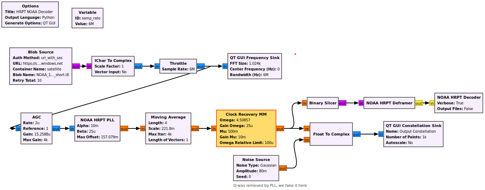
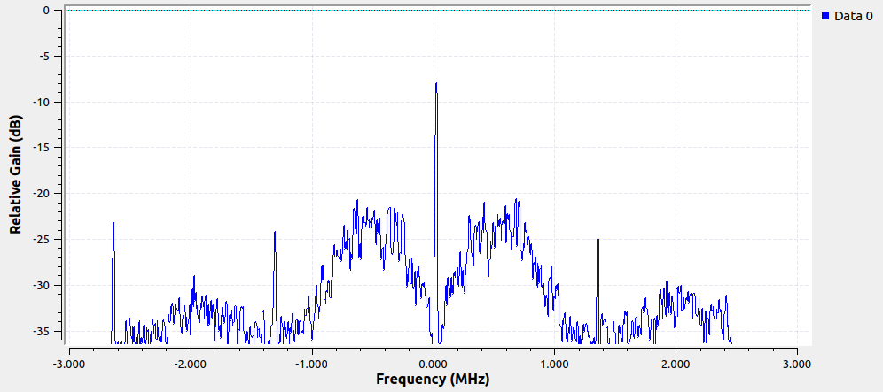
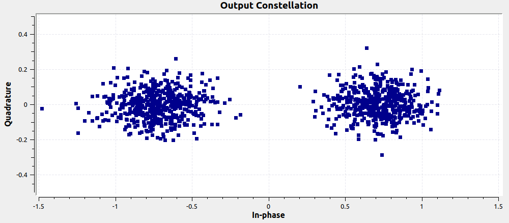
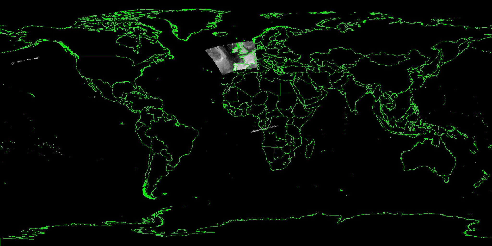

## Decoding NOAA Satellite Signal

## Introduction

In this tutorial we will use a signal recorded from NOAA 19.  Launched in 2009, NOAA 19 is a weather satellite that uses an afternoon equator-crossing (sunsynchronous) polar orbit.  It is part of the Polar Operational Environmental Satellites (POES) series of satellites.  NOAA 19 was the final POES satellite to be launched.  The POES system is being replaced by the Joint Polar Satellite System (JPSS) series of environmental satellites; only one has been launched so far (NOAA 20) but the next one is planned to launch in September 2022.  An artistic rendition of the NOAA 19 satellite is shown below.  More information about NOAA 19 and the different instruments can be found [here](https://en.wikipedia.org/wiki/NOAA-19). 

<center></center>

Onboard NOAA19 are the following instruments:

- Advanced Very High Resolution Radiometer (AVHRR)
- Solar Backscatter Ultraviolet Radiometer (SBUV)
- Microwave Humidity Sounder (MHS)
- High Resolution Infrared Radiation Sounder (HIRS)
- Advanced Microwave Sounding Unit (AMSU)
- Space Environment Monitor (SEM)
- Advanced Data Collection System (ADCS)
- Search And Rescue Satellite-Aided Tracking (SARSAT)

The signal we will be decoding contains a combination of imagery from several of these instruments, although we will be focusing on AVHRR, as it is the primary imaging system that contains the highest resolution imagery.  This imagery consists of visible light, near infrared (IR), and thermal IR channels, picking up vegetation, clouds, bodies of water, shorelines, snow, and ice.  

The digital protocol used for this signal is called High Resolution Picture Transmission (HRPT), and it is transmitted at a frequency of 1.698 GHz by NOAA 19.  The signal bandwidth is roughly 4.5 MHz, so we used a 6 MHz sample rate to capture and record the signal.  The data uses binary phase-shift keying (BPSK) digital modulation at a symbol rate of 665.4 kHz.  It does not contain forward error correction (a.k.a channel coding).  The satellite downlinks its data as it passes overhead.

## Installing the gr-hrpt Out-of-Tree Module

To decode this signal we will need a few HRPT-specific blocks which we can get from gr-hrpt.  The process of installing the **gr-hrpt** OOT module onto a system with GNU Radio already installed is as follows.  Open a terminal and type:
```console
git clone https://github.com/777arc/gr-hrpt.git
cd gr-hrpt
mkdir build
cd build
cmake ..
make
sudo make install
sudo ldconfig
```

## Running the Flowgraph

We will use a flowgraph that demodulates and decodes the NOAA 19 signal recording pulled down from blob storage.  Open the flowgraph [NOAA_HRPT_Decoder.grc](flowgraphs/NOAA_HRPT_Decoder.grc) which is in the satellite_decode/flowgraphs directory within this repo.   Ignore the fact that one of the blocks is orange, it simply means that block is being deprecated in a future version of GNU Radio.  The RF recording starts before the satellite is close enough to receive its signal, and as time goes on the satellite gets closer to the receiver.  This flowgraph is throttled at the same rate the signal was captured at, so you will experience the time it takes for the satellite to slowly come within range.  Run the flowgraph, and make sure to wait long enough for the signal to appear (there should be noise prior to that point.)

<center></center>

In the top portion of the GUI the signal's power spectral density (frequency domain) is shown, you can see there are two main lobes, two side lobes, and a few spikes. 

<center></center>

The bottom portion shows the constellation plot, which is how we can visualize the fast its using BPSK modulation.  The 1's and 0's are encoded into 1's and -1's, so when the blob finally splits in half corresponds to when the data can be reliably demodulated and decoded. 

Note that we don't see any Doppler shift in this signal because as part of receiving this signal, the ground station had to follow the satellite as it passed overhead, which means it needed its orbit information.  That means it was convinient to reverse the Doppler as part of the receiving process, as the relative velocity between the satellite and receiver was known.  Reversing Doppler is as simple as a frequency shift, based on the relative velocity at that moment.

<center></center>

If you look at your GRC window, in the bottom-left you should see the data being decoded, once the signal becomes strong enough. 

Go ahead and stop the flowgraph.  Now click the Throttle block and hit the B key which will cause it to be bypassed.  Disable the two QT GUI blocks by clicking them and hitting D.  Add a File Sink block at the output of the Deframer, to save the short-ints (yellow port) to a file called hrpt_out.raw16 on your VM.  Now run the flowgraph again, it will decode the signal much faster because there are no GUIs to render and the throttle is disabled.  When the messages in the console stop changing you know you have finished processing the entire file and you can close the window.  

## Using SatDump

While GNU Radio performed the heavy lifting, in the form of signal processing, we need an additional utility to graphically render the imagery data we have decoded, as GNU Radio does not have a map-based GUI.  We can use [SatDump](https://github.com/altillimity/SatDump) to generate the imagery using data decoded from the same signal you just decoded in GNU Radio.  Note that the rest of this section is optional, the output is provided at the end of this tutorial.

Within your VM we will install SatDump using the following commands:
```
sudo apt-get install -y git build-essential cmake g++ pkgconf libfftw3-dev libjpeg-dev libpng-dev libnng-dev libvolk2-dev
cd ~
git clone git://github.com/altillimity/SatDump.git
cd SatDump
mkdir build && cd build
cmake -DCMAKE_BUILD_TYPE=Release -DNOGUI=ON -DENABLE_SDR_AIRSPY=OFF -DCMAKE_INSTALL_PREFIX=/usr ..
make -j8
```

This installs the dependencies for SatDump, then builds SatDump.

While still in the build directory, run the following command, which will feed the file saved from GNU Radio into SatDump:
```
./satdump noaa_hrpt frames /tmp/hrpt_out.raw16 all_products ~/satdump_out/
```

Now open a file explorer and go to the satdump_out directory in your home directory, and you should see many files.  lFor those who skipped this section, the two images shown below represent the key output from SatDump.

## Viewing the Output

The first graphic below shows a world map interface with the satellite's viewable region shown (the imagery data is being overlayed on the map).  The green lines were not part of the decoded data, they were simply rendered by SatDump.  You can see that the satellite was over the Spain/France area when this signal was downlinked from the satellite.

<center></center>

The AVHRR portion of the data (the high resolution imagery) is shown below.  You may have seen similar examples of NOAA weather imagery that had color; those colors were added by a tool as part of post-processing, here we show the raw imagery (although it has been rotated so North is up).  Notice how the upper edge is noisy, this represents the few seconds as the satellite's signal was just barely receivable, there were many bit errors due to the 2 clusters of BPSK intersecting.  Because there is no forward error correction, we don't know that these bit errors occurred, although looking at the imagery it is obvious to us.


## TODO: Run SatDump in a Docker container, triggered via Azure Function

Scratch pad:

```console
curl https://packages.microsoft.com/keys/microsoft.asc | gpg --dearmor > microsoft.gpg
sudo mv microsoft.gpg /etc/apt/trusted.gpg.d/microsoft.gpg
sudo sh -c 'echo "deb [arch=amd64] https://packages.microsoft.com/repos/microsoft-ubuntu-$(lsb_release -cs)-prod $(lsb_release -cs) main" > /etc/apt/sources.list.d/dotnetdev.list'
sudo apt-get update
sudo apt-get install azure-functions-core-tools-4

cd ~
mkdir docker
cd docker

func init --worker-runtime powershell --docker
func new --name RunSatDump --template "Azure Blob Storage trigger"
```

If it prompts you about powershell just choose "1".  

Now edit the Dockerfile it produced, erase what is there and add:
```docker
FROM mcr.microsoft.com/azure-functions/powershell:4
ENV AzureWebJobsScriptRoot=/home/site/wwwroot \
    AzureFunctionsJobHost__Logging__Console__IsEnabled=true

COPY . /home/site/wwwroot

RUN apt-get update && apt-get install -y git build-essential cmake g++ pkgconf libfftw3-dev libjpeg-dev libpng-dev libnng-dev libvolk2-dev

RUN git clone --depth 1 git://github.com/altillimity/SatDump.git && cd SatDump && mkdir build && cd build && cmake -DCMAKE_BUILD_TYPE=Release -DNOGUI=ON -DENABLE_SDR_AIRSPY=OFF -DCMAKE_INSTALL_PREFIX=/usr .. && make -j8
```

Now create a storage account, or go to an existing storage account, and make note of your connection string.  Then make a new function app called satdumpcontainer, choose container and Powershell.

Test the docker container with

```console
docker build -t satdumpimage .
docker run -it --name satdumpcontainer satdumpimage
sudo docker exec -it satdumpcontainer /bin/bash
```